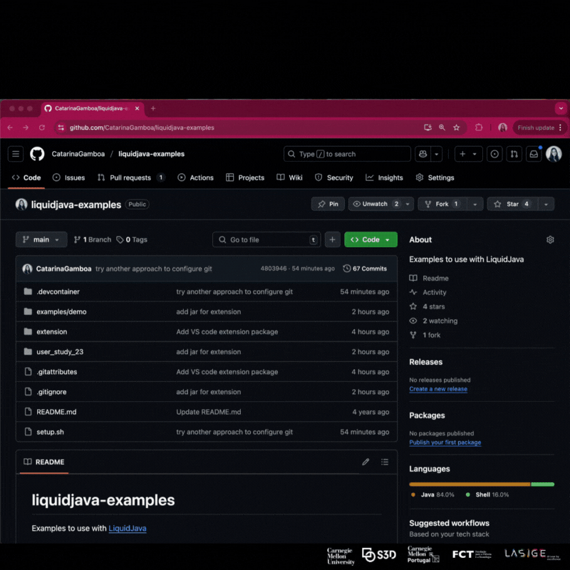

# LiquidJava Examples

Welcome to the LiquidJava examples repository! 

This collection demonstrates how to use LiquidJava, a powerful extension for Java that enables expressive type refinements through annotations. Whether you're new to LiquidJava or looking to deepen your understanding, these examples will help you explore its capabilities and learn how to enhance your Java code with sophisticated type checking.

For more information about LiquidJava, visit our [website](https://catarinagamboa.github.io/liquidjava.html)!

## Development Environment Setup
🚀 Check the following video on the setup:


### Setup Instructions

#### Option 1: Using Codespaces (Recommended)

- To use codespaces, make sure you’re logged in to GitHub, click the button below, select `4-core`, and then press `Create codespace`. The codespace will open in your browser and will automatically install the LiquidJava extension shortly after.

   [](https://codespaces.new/rcosta358/liquidjava-examples)

#### Option 2: Using Dev Containers

- If you prefer to test it locally, you can use VS Code's Dev Containers. Make sure you have Docker and the Dev Containers extension installed in VS Code and use the "Remote-Containers: Open Folder in Container" command. Then, run the `setup.sh` script to install the extension.

#### Option 3: Manual Setup

If the automatic setup didn't work correctly, follow these manual steps:

1. Install Git LFS if not already installed:
   ```bash
   sudo apt-get update && sudo apt-get install -y git-lfs
   git lfs install
   ```

2. Pull LFS files:
   ```bash
   git lfs pull
   ```

3. Install the extension:
   - In VS Code, go to the Extensions view (View → Extensions)
   - Click on the "..." (More Actions) button
   - Select "Install from VSIX..."
   - Navigate to `extension/liquid-java-0.0.15.vsix` in the repository
   - Click "Install"

   Alternatively, use the terminal:
   ```bash
   code --install-extension extension/liquid-java-0.0.15.vsix
   ```

4. Ensure the redhat extension for [Language Support for Java™](https://marketplace.visualstudio.com/items?itemName=redhat.java) is installed and enabled.

5. Open examples:
   - Go to File → Open Folder → examples/demo/src/
   - Or use the terminal:
   ```bash
   code examples/demo/src/
   ```

### Troubleshooting

##### Extension Activation

- The extension displays an item in the status bar at the bottom left of VS Code, indicating its current state.
- The extension will only activate when opening a Java project with the `liquidjava-api.jar` present in the workspace.
- If the extension doesn't activate properly, do `Ctrl + Shift + P` and run `Developer: Reload Window`.

#### VSIX File Issues

If you see "End of central directory record signature not found" or similar errors:

1. This is likely a Git LFS issue. Make sure Git LFS is installed and run:
   ```bash
   git lfs pull
   ```

2. Verify the VSIX file isn't just a pointer:
   ```bash
   cat ./extension/liquid-java-0.0.15.vsix | head
   ```

## Working with the Extension

1. Ensure your project is correctly set up with the `liquidjava-api.jar`.
2. When opening a Java file, the extension will automatically verify your LiquidJava annotations.
3. Errors will be highlighted directly in your code editor.

## Download JARs

`examples/demo/lib` folder contains the api jar that you can use in your projects.


## Examples
```
liquidjava-examples/
├── examples/                          
│   ├── demo/                           # Simple demo examples
│   │   ├── src/main/java/com/example   # Examples start with "Test*.java"
├── user_study_23/                      # Example projects used for user study of 2023
│   ├── part1-plainJava/                # Java projects without LiquidJava
│   ├── part3-liquidJava/               # Projects with LiquidJava annotations
│   └── part4/                          # Files to be annotated with LiquidJava
├── extension/                          # Contains the VSIX extension file
...
```
### 2022/23 User Study:
#### part1-plainJava
Contains Java projects without LiquidJava.
Open one of the folders on VS Code and find the error.

#### part3-liquidJava
Contains LiquidJava projects.

Open one of the folders on VS Code with the extension running. Uncomment the code in the Test file and find the error. You can open the folder through the terminal by going to the correct path and typing `code` or open through the VS Code GUI.

#### part4
Contains Java files to be annotated with LiquidJava.
- **Variable.java** - Add the annotation and check the correct and wrong assignment
- **TrafficLight.java** - Add the annotations on the fields and model the state using `@StateSet` and `@StateRefinement`. To check if the modelling is correct, uncomment the file `TestTLCorrect.java` (that should be correct) and then uncomment the file `TestTLWrong.java` that should present an error.
## Advanced Development

For extension development:
- Refer to the VS Code Extension API documentation
- Make changes to your code and test using the provided examples
- Use the debug console to troubleshoot any issues
